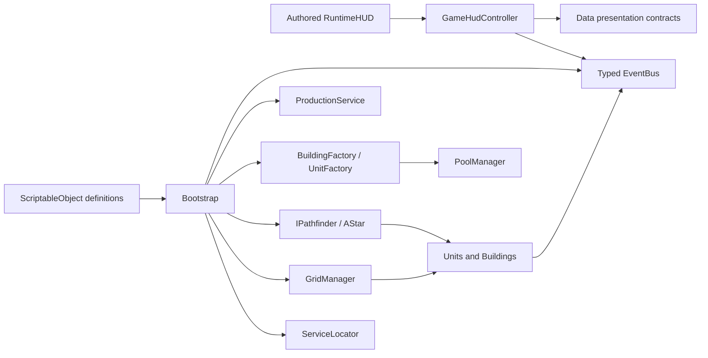

# Panteon 2D Strategy Demo

A completed Unity 2D strategy-game prototype built around grid-based building placement, unit production, multi-unit control, A* pathfinding, and melee combat. The project was developed as a production-minded case study: gameplay code is separated from presentation, content is data-driven, reusable objects are pooled, and performance-sensitive visuals are batched wherever practical.

## Project at a Glance

| Item | Value |
|---|---|
| Unity version | `2021.1.29f1` |
| Main scene | `Assets/_Project/Scenes/Main.unity` |
| Rendering | Unity 2D, `SpriteRenderer`, uGUI |
| Input | Mouse and keyboard through Unity's legacy `Input` API |
| Board | 24 × 16 cells, one world unit per cell |
| UI scale | Authored HUD at a fixed 2.0× logical scale |
| Tests | NUnit Edit Mode tests through Unity Test Framework |

The scene and `RuntimeHUD` are already authored and wired. No scene generator or editor setup tool is required.

## Quick Start

1. Open the repository from Unity Hub with Unity `2021.1.29f1`.
2. Open `Assets/_Project/Scenes/Main.unity`.
3. Enter Play Mode.
4. Choose a building from the Production panel and place it on a valid board cell.
5. Select a Barracks to produce units, then command those units with the mouse.

### Controls

| Action | Input |
|---|---|
| Choose a building | Left-click a card in the Production panel |
| Place a building | Left-click a valid grid area |
| Cancel placement | `Escape` or right mouse button |
| Select one unit or building | Left-click it |
| Select multiple units | Hold left mouse button and drag a selection rectangle |
| Move selected units | Right-click an empty grid cell |
| Attack a unit or building | Right-click the target while units are selected |
| Pan the board camera | `WASD` or arrow keys |

Pointer input over the HUD is blocked from reaching the game board, preventing accidental placement or commands through UI panels.

## Implemented Gameplay

### Building Placement

- Buildings snap to exact grid coordinates and reserve their complete footprint.
- The placement ghost uses the same content-aware scaling calculation as the final building, so its preview matches the placed result.
- Green and red ghost states communicate valid and invalid placement.
- Overlap and out-of-bounds placement are rejected.
- Buildings may be placed directly beside one another; no artificial one-cell gap is required.
- Placement feedback uses a short squash/overshoot reveal, warm flash, base dust, and subtle camera response.

The included catalog contains:

| Building | Footprint | HP | Purpose |
|---|---:|---:|---|
| Barracks | 4 × 4 | 100 | Produces units |
| Power Plant | 2 × 3 | 50 | Faction power building |
| Watch Tower | 2 × 2 | 75 | Defensive building |
| Supply Depot | 2 × 2 | 60 | Faction supply building |

### Production and Spawn Points

- Every production building owns a designated spawn offset in its `BuildingDefinitionSO`.
- The preferred spawn point is used when it is available.
- If another building blocks that side, the Barracks evaluates all cells along its bottom, top, left, and right edges and chooses the closest valid alternative.
- `UnitFactory` performs a breadth-first search from the chosen spawn point when another unit already occupies it. Multiple soldiers therefore emerge in the nearest free cells instead of stacking on one grid position.
- Production requests travel through the event bus to `ProductionService`; the UI never creates gameplay units directly.

The Barracks currently exposes four animated Tiny Swords units:

| Unit | HP | Damage | Move Speed | Attack Cooldown |
|---|---:|---:|---:|---:|
| Warrior | 24 | 8 | 3.0 | 0.8 s |
| Archer | 14 | 5 | 3.0 | 1.0 s |
| Lancer | 20 | 7 | 3.0 | 0.8 s |
| Monk | 16 | 3 | 3.2 | 1.2 s |

All four current definitions use close-range combat. The data model also supports ranged range values, projectile sprites, and attack-fire feedback without changing `Unit` or HUD code.

### Selection and Group Commands

- Single-click selection works for both units and buildings.
- Drag selection collects every living player unit inside the screen-space rectangle.
- The Information panel switches between a detailed single-entity card and a multi-selection list containing each selected unit's portrait and name.
- Group movement distributes destinations in a spiral around the clicked cell to reduce endpoint stacking.
- Group attacks send every selected unit to the same target while each unit independently chooses a reachable attack position.
- Death events remove destroyed entities from the active selection immediately and refresh the HUD through events.

### A* Pathfinding

`AStarPathfinder` implements `IPathfinder`, allowing the movement algorithm to be replaced without changing unit logic.

- A binary min-heap provides efficient open-set access.
- An octile heuristic supports eight-direction movement with 10/14 straight and diagonal costs.
- Diagonal corner cutting is rejected when either orthogonal neighbor is blocked.
- Every occupied cell of a building footprint is treated as an obstacle, not just the building's pivot.
- Units move through exact grid-cell centers.
- The grid exposes a revision number. A unit checks that revision while travelling and replans if its next step becomes blocked by a newly placed building.
- Attack movement scores reachable perimeter cells by actual path distance first, then target proximity. This avoids always choosing a fixed corner of a large building.
- When a target dies or a command is interrupted between cells, the unit performs a short eased snap to the nearest walkable cell instead of teleporting or remaining diagonally off-grid.

Both movement and attack commands display the calculated path as hollow army-green rings—one ring per path cell. A unit removes passed rings as it advances.

### Combat, Animation, and Feedback

- Unit behavior is represented by a small state machine: `Idle`, `Moving`, `Attacking`, and `Dead`.
- Attacks contain anticipation, animation-driven impact delay, damage application, and cooldown phases.
- `HealthComponent` clamps damage, publishes health changes, and guarantees that death fires only once.
- Health bars are visible from spawn for both units and buildings.
- A unit completes its death animation before it is returned to its pool.
- Directional animation supports Up, Up-Right, Right, Down-Right, and Down, with renderer flipping for the mirrored left directions.
- Animation clips are discovered by a naming contract instead of a manually maintained state list. Names containing `idle`, `run`/`walk`/`move`, `attack`/`shoot`/`heal`, `hit`/`hurt`/`damage`, and `death`/`dead`/`die` are mapped automatically.
- Unit hits use recoil, flash, directional impact particles, and a short impact pause.
- Building hits produce a single smoke/dust burst at a randomized position inside the building's visible sprite bounds. There is no permanent smoke emitter.
- Move and attack clicks use pooled, pulsing command markers with distinct colors and a high-contrast outline.
- Camera shake is event-driven and used selectively so feedback remains readable rather than constant.
- Health bars use delayed chip damage and pulse when an entity reaches critical health.

Audio is intentionally not included in the final submission; the final feedback layer is visual.

## Architecture

The project uses a composition-root approach. `Bootstrap` creates and connects runtime services once, while scene objects and ScriptableObjects supply references and content.



### Assembly Boundaries

The code is divided into assembly definitions to enforce compile-time dependencies and shorten incremental recompilation.

| Assembly | Responsibility | References |
|---|---|---|
| `Panteon.Core` | Event bus, pooling, service registry, low-level interfaces | None |
| `Panteon.Data` | ScriptableObject definitions, presentation contracts, game events, animation contract | `Panteon.Core` |
| `Panteon.Gameplay` | Grid, factories, placement, selection, units, combat, pathfinding, feedback | `Panteon.Core`, `Panteon.Data` |
| `Panteon.UI` | Authored HUD bindings, views, layout, information and production presentation | `Panteon.Core`, `Panteon.Data`, `UnityEngine.UI` |
| `Panteon.Tests` | Edit Mode unit and integration-oriented tests | All project assemblies |

`Panteon.UI` deliberately has no reference to `Panteon.Gameplay`. It works through narrow interfaces such as `IEntityPresentation`, `IUnitPresentation`, `IProductionBuilding`, `IBuildingPlacementService`, and `IInputBlocker`.

### Design Principles and Patterns

| Principle or pattern | Application |
|---|---|
| Single Responsibility | Pathfinding, placement, production, selection, HUD layout, animation, health, and feedback are separate collaborators. |
| Open/Closed | New building and unit definitions are added through ScriptableObjects and catalogs without editing menu logic. `IPathfinder` allows another path strategy. |
| Liskov Substitution | `Unit` and `Building` share the `Entity` lifecycle and can be consumed through selection, damage, and presentation contracts. |
| Interface Segregation | UI and gameplay use small purpose-specific contracts rather than one large entity interface. |
| Dependency Inversion | Factories and units depend on abstractions such as `IPathfinder`; UI depends on Data contracts rather than concrete gameplay types. |
| Factory | `BuildingFactory` and `UnitFactory` own construction, initialization, root parenting, event publication, and pool return. |
| Object Pool | `PoolManager` maintains one expandable `ObjectPool` per prefab and invokes `IPoolable` lifecycle callbacks. |
| Observer / Event Bus | Typed struct messages decouple selection, production, health, death, camera, HUD, and command feedback. |
| State | `UnitStateMachine` exposes explicit unit behavior states and state-change notifications. |
| Strategy | A* is supplied through `IPathfinder`. |
| Presenter / MVC-style UI | `GameHudController` coordinates state, dedicated views render it, and gameplay/data remain outside the view layer. |
| Controlled Singleton | `ServiceLocator` is the only global service access point and is cleared by `Bootstrap`; individual gameplay systems are not global singletons. |
| Inheritance plus composition | `Entity` centralizes shared selection/health/feedback behavior, while focused components provide health, production, animation, grid occupancy, and visuals. |

## Data-Driven Content

### Buildings

`BuildingDefinitionSO` stores:

- display name and description;
- UI/world sprite and prefab;
- grid footprint;
- normalized visible-content rectangle used for correct sprite fitting;
- maximum HP;
- production capability and producible unit list;
- designated spawn-point offset.

`BuildingCatalogSO` is the single source for the Production menu and bootstrap prewarming. The menu creates exactly one data entry per unique catalog definition; it does not manufacture duplicate building definitions.

### Units

`UnitDefinitionSO` stores gameplay stats and card presentation:

- name, description, icon, and icon-content crop;
- prefab and `UnitVisualProfileSO`;
- maximum HP, damage, movement speed, range mode, range, and cooldown.

`UnitVisualProfileSO` stores visual/animation timing:

- animator controller and reference sprite;
- world visual height and content ratio;
- attack impact and hit timing;
- optional projectile and attack-fire data.

This separation allows balancing to change without touching animation assets and visual tuning to change without editing unit combat code.

## HUD and Responsive Presentation

- `RuntimeHUD.prefab` is authored once and is already present in `Main`; the complete HUD hierarchy is not generated during Play Mode.
- Its CanvasScaler uses a 1920 × 1080 reference resolution, while project layout calculations run at a fixed 2.0× logical scale.
- `GameHudController` acts as an orchestrator. Layout and rendering responsibilities live in `ProductionMenuView`, `InformationPanelView`, `BoardViewportController`, and `HudViewFactory`.
- Serialized binding components replace repeated hierarchy-name searches and fail early when a required prefab reference is missing.
- The Production panel uses two columns and reads directly from `BuildingCatalogSO`.
- Downward infinite scrolling activates only when the natural card content exceeds the viewport. When four cards fit, scrolling remains disabled. When enabled, the existing card views are repositioned over an extending virtual content area instead of duplicating catalog data.
- A selected unit displays portrait, name, description, health, and attack data.
- A selected building displays portrait, name, description, current health, and—when supported—a horizontally scrollable unit-production list.
- With no selection, the Information panel intentionally remains empty below its title.
- Production cards and information portraits fit the sprite's visible-content bounds, avoiding atlas padding and transparent margins that make artwork appear undersized or off-center.
- Pixelify Sans is used throughout the game-facing UI with fixed text sizes and card dimensions that prevent labels from auto-shrinking or wrapping unpredictably.
- `BoardViewportController` calculates a pixel-aligned camera viewport from the authored HUD board area. The grid retains square cells at different aspect ratios and high resolutions, including 4K.

## Performance and Draw-Call Strategy

The case target is fewer than 20 SetPass calls in the representative gameplay view. The project is structured around that budget:

| Area | Optimization |
|---|---|
| Sprite rendering | Dedicated `Units`, `Buildings`, and `HUD` Sprite Atlases group frequently rendered content for batching. Atlases use point filtering, no mipmaps, and no rotation/tight packing to preserve pixel-art orientation and edges. |
| Materials | The main unit/building prefabs share `M_BatchedSprites.mat`. Path previews, command feedback, combat particles, projectiles, and secondary building visuals also reuse shared materials rather than creating one material per instance. |
| Grid | The complete board grid is generated as one point-filtered texture and rendered by one `SpriteRenderer`, rather than hundreds of cell GameObjects or UI Images. |
| Path preview | All rings for one unit are written into one reusable dynamic mesh. A path does not create one GameObject or renderer per node. |
| Units and buildings | Factories obtain and return entities through expandable prefab pools. |
| Startup | `Bootstrap` prewarms each unique building prefab and unit prefab in small coroutine batches, spreading initialization over frames. |
| Command markers | Marker objects are prewarmed and recycled from a bounded feedback pool. |
| UI updates | Selection and health presentation are event-driven; panels are not rebuilt through gameplay polling. |
| Responsive grid | The grid texture is regenerated only when the integer pixels-per-cell value changes, not every frame. |
| Compilation | Assembly definitions isolate Core, Data, Gameplay, UI, and Tests. |
| Player settings | Static/dynamic batching, incremental garbage collection, engine-code stripping, and material-instancing variants are enabled. |

SetPass count is affected by platform, camera visibility, selected UI state, atlas page count, and Unity's batching rules. Verify the final build with the Game view Statistics overlay, Profiler, and Frame Debugger. If an atlas grows beyond one page, keep sprites that appear together on the same page or split atlases by faction/use case; each additional visible page may introduce another material switch.

## Coroutines and Events

Coroutines are used for time-based or amortized work rather than as hidden global loops:

- batched pool prewarming;
- cell-to-cell movement;
- attack anticipation, impact, and cooldown;
- smooth grid snapping after interrupted commands;
- hit, placement, command, and camera feedback;
- death animation completion before pool return.

The typed `EventBus` carries:

- building and unit selection;
- selection clearing;
- production requests;
- placement failures;
- health and death changes;
- command feedback;
- camera shake requests.

Event contracts are grouped by feature under `Scripts/Data/Events`. Each file owns a cohesive vocabulary—selection, building, entity, production, camera feedback, or command feedback—instead of accumulating unrelated messages in a catch-all event file. Closely related types, such as `CommandFeedbackType` and `CommandFeedbackRequested`, remain together because they form one public message contract.

Every long-lived subscriber explicitly unsubscribes during disposal or destruction.

## Tests

Open **Window → General → Test Runner**, select **EditMode**, and run all tests.

The suite currently contains 23 NUnit cases across six files and covers:

- A* obstacle avoidance and unreachable goals;
- shortest diagonal paths;
- prevention of diagonal corner cutting;
- occupied start rejection;
- avoidance of every cell in a 4 × 4 footprint;
- binary-heap ordering and tie-breaking;
- grid bounds, adjacent footprints, overlap rejection, and area centers;
- object-pool growth and instance reuse;
- health clamping and single-fire death;
- typed event unsubscription;
- animation direction resolution and stable state hashes;
- validation that all four unit Animator state names match their AnimationClip names.

## Adding Content

### Add a Building

1. Create or duplicate a building prefab containing the existing building, health, selection, grid-occupancy, collider, and visual components.
2. Create **Panteon → Building Definition**.
3. Assign the prefab, icon, footprint, HP, visible-content rectangle, and spawn offset.
4. Enable production and assign unit definitions only if the building should produce units.
5. Add the definition once to `SO_BuildingCatalog`.

The Production menu, placement ghost, information card, and prewarm pass will use the new definition automatically.

### Add a Unit

1. Prepare directional animation clips and an Animator Controller.
2. Keep Animator state names identical to their clip names.
3. Include the supported semantic and direction tokens in clip names—for example `Idle`, `Run_Right`, `Attack_DownRight`, `Hit_Up`, and `Death`.
4. Create **Panteon → Unit Visual Profile** and assign the controller, reference sprite, sizing, and animation timings.
5. Create **Panteon → Unit Definition** and assign the prefab, profile, card icon, combat stats, and range mode.
6. Add the definition to the Barracks `Producibles` list.
7. Add frequently co-rendered sprites to the appropriate Sprite Atlas and inspect the atlas Pack Preview.

The Barracks information panel creates additional production cards from its authored template and enables horizontal scrolling when the unit count exceeds the visible capacity.

## Project Layout

```text
Assets/
├── _Project/
│   ├── Fonts/                 Pixelify Sans UI fonts
│   ├── Prefabs/               Buildings, units, and authored RuntimeHUD
│   ├── Scenes/Main.unity      Ready-to-play demo scene
│   ├── ScriptableObjects/     Building catalog, building definitions, unit definitions, visual profiles
│   ├── Scripts/
│   │   ├── Core/              Event bus, pools, service registry, base contracts
│   │   ├── Data/              Definitions, feature-grouped events, presentation and animation contracts
│   │   ├── Gameplay/          Grid, pathfinding, placement, selection, production, combat, feedback
│   │   └── UI/                HUD bindings, views, layout, production and information presentation
│   ├── Settings/              Units, Buildings, and HUD Sprite Atlases
│   ├── Tests/EditMode/        NUnit tests
│   └── Visuals/               Project-specific presentation assets
└── Tiny Swords/               Integrated unit and building pixel-art assets
```

## Intentional Trade-offs

- This is a focused technical sandbox, not a complete strategy-game loop: there is no economy, AI opponent, victory condition, or production timer.
- The current scene contains player-controlled content only. Attack commands accept any other `IDamageable` target and do not currently apply a same-faction rejection rule.
- The demo uses the legacy mouse `Input` API to stay compatible with its Unity version and compact case scope.
- `ServiceLocator` is intentionally restricted to composition and cross-assembly service resolution. Constructor/configuration injection is used for the core runtime collaborators.
- Group movement uses deterministic spiral destinations rather than a full crowd-steering or local-avoidance simulation.
- A* runs per unit and replans only when relevant grid occupancy changes. A larger RTS could add shared flow fields, hierarchical pathfinding, or jobs.
- The HUD is authored for clarity and deterministic layout; only overflow cards/rows are cloned from authored templates.
- The SetPass target must be profiled on the intended platform and content scale; it is not treated as a hard-coded runtime number.

This project is intentionally small enough to review in one sitting while demonstrating production-oriented boundaries, extensibility, testability, and performance awareness.
